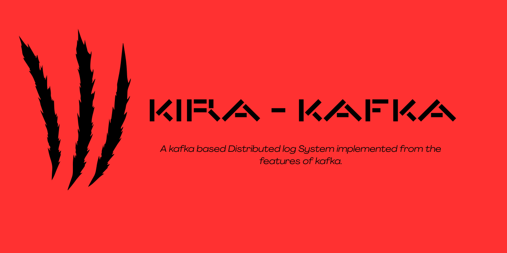

# ⚙️ Kira-Kafka — A Distributed Log System in C




Welcome to **Kira-Kafka**, lightweight, and educational **distributed log system** written in pure C. This project mimics the core architecture of Apache Kafka — covering **topics**, **partitions**, **message brokers**, **disk-backed logs**, **zero-copy reads**, **memory-mapped I/O**, **thread-to-core mapping**, and **log compression**.

> 🔬 Designed for learning, systems programming enthusiasts, and OS-level Kafka internals.

---

## 🌟 Features

| Kafka Feature                    | Kira-Kafka Implementation                                |
|----------------------------------|-----------------------------------------------------------|
| **Topic & Partitioning**         | `Topic` structure with round-robin partitioning          |
| **Disk-Based Log Storage**       | Append-only `.log` files for each partition              |
| **Zero-Copy Reads**              | `sendfile()` syscall for NIC-efficient file transfer     |
| **Memory-Mapped I/O**            | `mmap()` for reading logs as byte arrays                 |
| **Thread-Core Affinity**         | `pthread_setaffinity_np()` for log/consumer separation   |
| **Flush Daemon (Durability)**    | Background `fsync()` log flush thread                    |
| **Load Balancing**               | Per-thread round-robin dispatch to partitions            |
| **Open Source Friendly**         | Community-driven, well-documented, modular structure     |

---
## 📁 Project Structure

```
KIRA-KAFKA/src
├── appendLog/
│   ├── include/             # Headers for append-only log
│   ├── src/                 # C source files for disk logging
│   ├── temp/                # Temporary log data (buffered writes)
│   ├── kafka_appendLog      # Binary output
│   └── main.c               # Log writer entry point
│
├── mmap/
│   ├── include/             # Headers for memory-mapped I/O
│   ├── src/                 # mmap-based log readers
│   ├── kafka_mmap           # Compiled output binary
│   ├── main.c               # mmap reader demo
│   └── Makefile             # Build script for mmap module
│
├── partitioning/
│   ├── include/             # Headers for topic/partition logic
│   ├── src/                 # C source files for round-robin dispatch
│   ├── kafka_partitioning   # Compiled output binary
│   ├── main.c               # Partitioning logic demo
│   └── Makefile             # Build script for partitioning module
│
├── threadCore/
│   ├── include/             # Headers for thread-core mapping
│   ├── src/                 # Source files for CPU affinity logic
│   ├── kafka_threadCore     # Compiled binary
│   ├── main.c               # Thread-core mapping demo
│   └── Makefile             # Build script for threadCore module
│
├── zeroCopy/
│   ├── include/             # Headers for zero-copy I/O
│   ├── src/                 # sendfile() based implementation
│   ├── kafka_zeroCopy       # Output binary for zero-copy demo
│   ├── main.c               # Zero-copy file transfer example
│   └── Makefile             # Build script for zeroCopy module
│
├── Makefile                 # Optional root Makefile to build all modules
└── README.md                # Full project documentation


```
## 🚀 Getting Started

### 🔧 Build

```
cd (required directory)
make
make run
```

## 📚 Discussions & Wiki

## 🤔 Have questions or ideas?
Start a discussion here:
👉 GitHub Discussions

### 📘 Internal Docs
Check the Wiki for: [Kira-Kafka Wiki](https://github.com/mery-top/Kira-Kafka/wiki)

## 🧠 Wiki Page: Kafka-Inspired Features Explained

The [Kira-Kafka Wiki](https://github.com/mery-top/Kira-Kafka/wiki) contains detailed, developer-friendly documentation of the core concepts and how they map to Kafka's design.

### 🧩 Feature Documentation

| Feature                    | Wiki Page Link |
|----------------------------|----------------|
| 📦 Topics & Partitioning   | [Topic & Partitioning](https://github.com/mery-top/Kira-Kafka/wiki/Features-of-Kafka#-1-zero-copy-via-sendfile)  
| 🧾 Append-Only Logs        | [Append-Only Logging](https://github.com/mery-top/Kira-Kafka/wiki/Features-of-Kafka#%EF%B8%8F-2-disk-based-sequential-log-appending)  
| 📤 Zero-Copy Reads         | [Zero-Copy with sendfile()](https://github.com/mery-top/Kira-Kafka/wiki/Features-of-Kafka#-1-zero-copy-via-sendfile)  
| 🗃 Memory-Mapped Reads     | [Memory-Mapped Files](https://github.com/mery-top/Kira-Kafka/wiki/Features-of-Kafka#-3-memory-mapped-files-mmap)  
| 🔄 Log Flusher             | [Flush Daemon & Durability](https://github.com/mery-top/Kira-Kafka/wiki/Features-of-Kafka#-6-log-segments--index-files)  
| 🧵 Thread-to-Core Mapping  | [Thread Affinity](https://github.com/mery-top/Kira-Kafka/wiki/Features-of-Kafka#-5-thread-to-core-mapping-for-performance)  

> 💡 Each page includes C code explanations, OS-level syscalls used, and comparisons to Kafka’s internal handling.

---

### 📖 Want to Contribute to the Wiki?

1. Go to the [Wiki tab](https://github.com/mery-top/Kira-Kafka/wiki)
2. Click **"New Page"**
3. Add your content and submit


Architecture diagrams
OS-level optimization explanations
How Kafka uses these techniques at scale


---

## 🤝 Contributing

We ❤️ contributors!

To contribute:

1. **Fork** the repository  
2. **Clone** it locally  
3. **Create a new branch** for your changes  
4. **Implement** your feature or bug fix  
5. **Submit a Pull Request (PR)** with a clear message and screenshot if applicable

```
git clone https://github.com/mery-top/kira-kafka.git
cd kira-kafka
git checkout -b feature/my-improvement
```

## 🪪 License

MIT License © Meerthika
